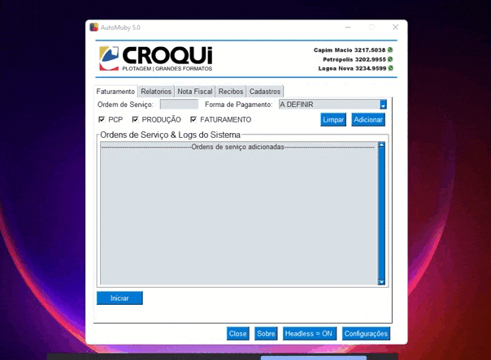
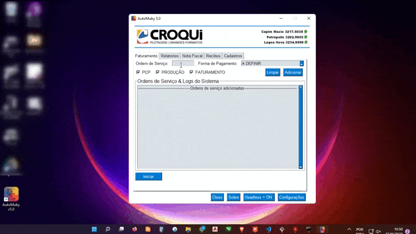
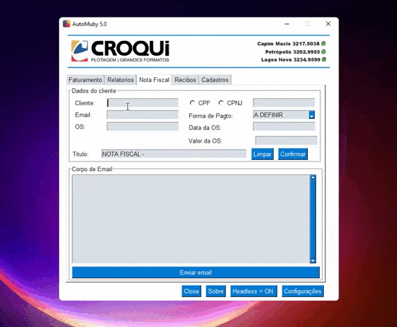
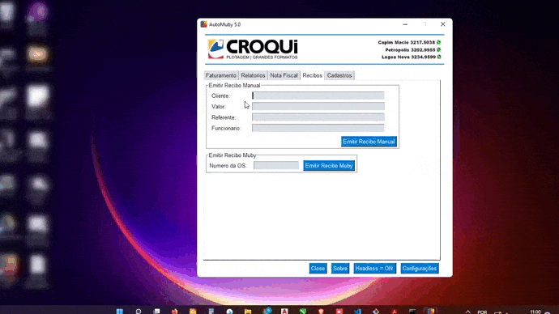
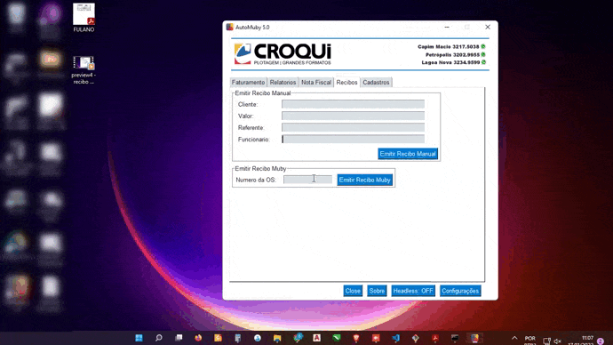

# Automação MubiSys

> Adriel Rosa (update 17/11/2022  14:00 PM)

Software desenvolvido em python com a intenção de atividades internas realizadas pelos funcionarios da grafica croqui na plataforma de vendas MubiSys, e algumas outras funcionalidades a mais.

## Funcionalidades Ativas: 

### Faturamento:

- Realiza o faturamento de ordens de serviços abertas (procedimento completo: PCP > Produção > Faturamento).

##

### Nota Fiscal:

- Cria um corpo de e-mail a ser enviado ao financeiro para solicitação de nota fiscal para o cliente (Sendo possivel alterar o campo do corpo de e-mail).

##

###  Recibo:

##

  
  
  - Manual: Emite um recibo manual utilizando bibliotecas de manipulação de planilha e exportação em PDF. 
  
  ###
  
  
  
  - Automatico: Função automatizada para buscar e emitir um recibo gerado pelo sistema MubiSys.
  
  ###
  
 ##
 
 ## Tecnologias:
 - Python
 - Bibliotecas Python: 
   - Playwright
   - openpyxl
   - win32com
   - num2words
 - Sqlite3
 - Git & GitHub
 
 ## Contato:
 
 - E-mail: adrielrosa@live.com 
 - LinkedIn: https://www.linkedin.com/in/adriel-rosa-660431144/
